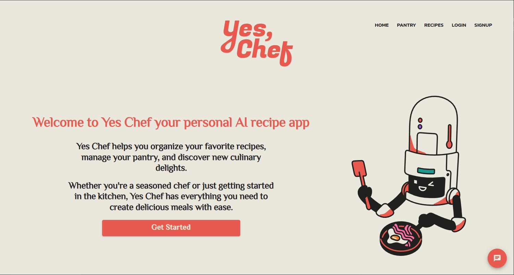
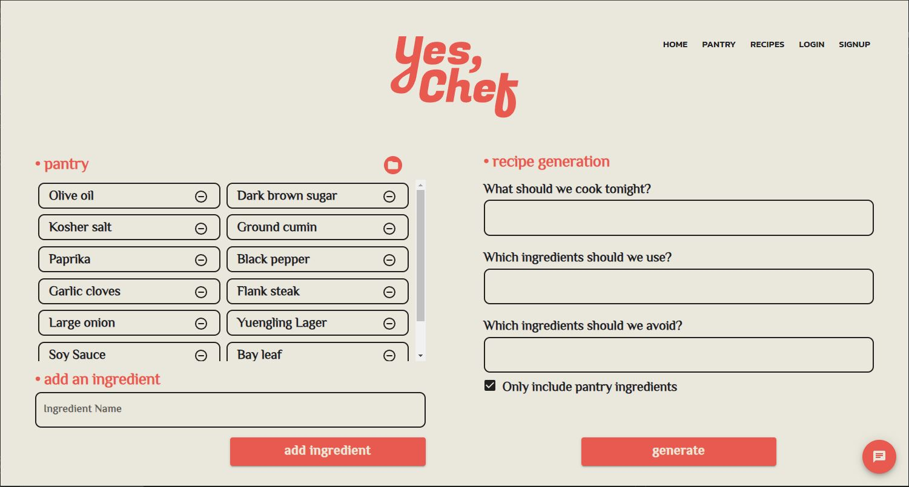
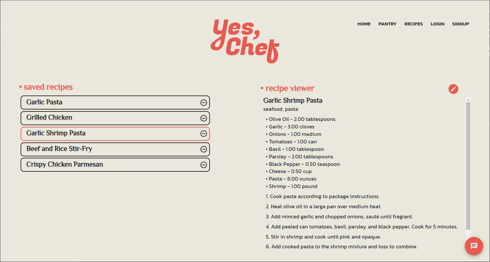
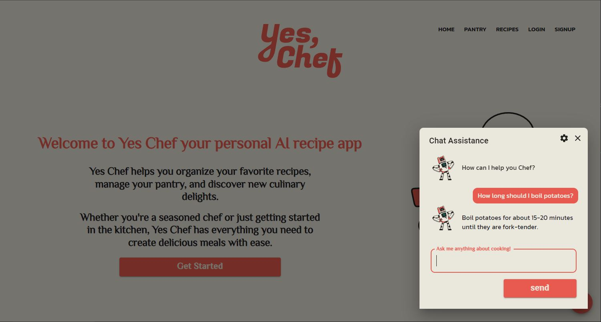

# Yes, Chef

Yes, Chef is an all in one cooking assistant built with React and Express. The front end styling is managed through MUI, and the backend calls to Open AI's API to generate recipes and answer user questions.

It can keep track of what ingredients are in a users kitchen, it can create and save AI generated recipes based on those ingredients as well as some additional user prompts, and it can provide answers to simple cooking questions.

### Creation Page

The Creation Page contains both the Pantry component and the Recipe Generation component. Here users can add and delete items that they have in their kitchen, as well as generate a recipe based on those items. Generating a recipe will send the prompt to Open AI and after a few seconds it will return a recipe that the user can Save, Clear, or Regenerate.

### Recipe Page

The Recipe Page contains all of the recipes that a user has saved. Here they can select a recipe to populate the Viewer component as well as remove recipes that they no longer want to store.

### Chat Helper

The Chat helper can be opened on any page, it is a small modal where users can interact with an AI chatbot with a few pre-loaded personalities. When a user types in a question the AI chatbot will do it's best to give an accurate answer swiftly.

